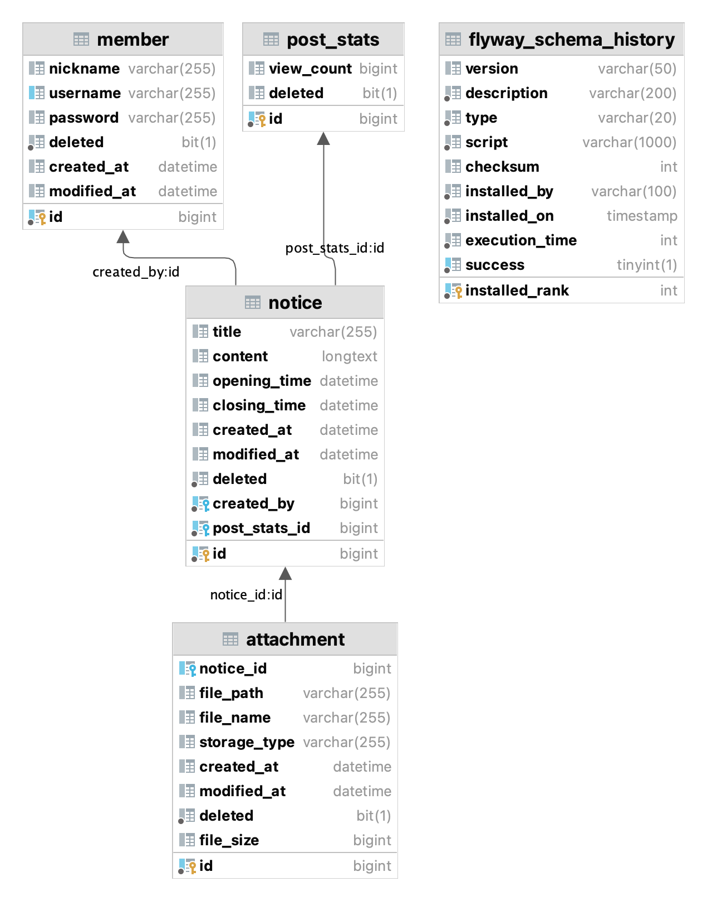
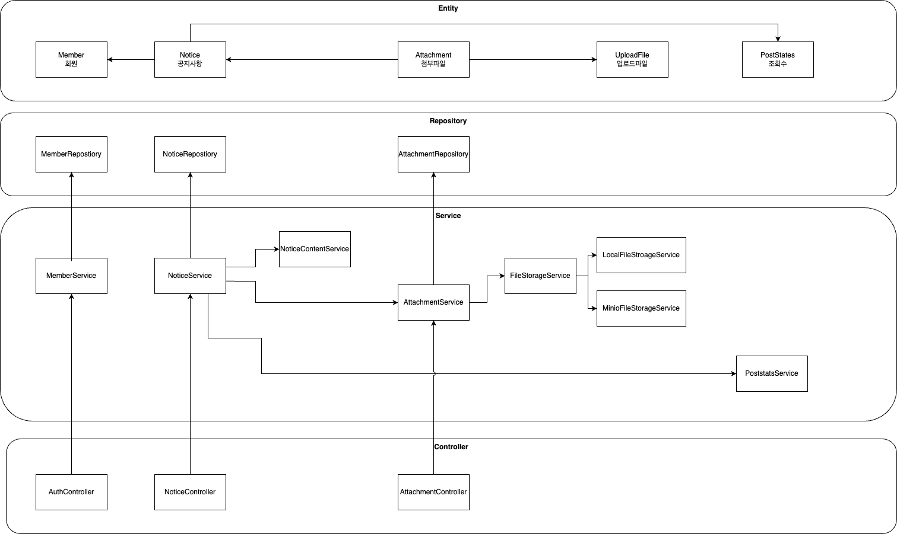

## 실행방법

### 실행 사전 준비

- Docker Desktop

```shell
$ brew install --cask docker
```

### 서버 실행

```shell
$ ./gradlew bootRun
```

### 테스트 실행

```shell
$ ./gradlew test
```

### API 호출 테스트

```
/rest/auth/signup.http
/rest/auth/get_token.http
/rest/notice/create.http
/rest/notice/delete-by-id.http
/rest/notice/get-by-id.http
/rest/notice/modify.http
/rest/notice/search.http
```

## 개발환경 세팅

```mermaid
# The Multiple Runtime Version Manager: ASDF
# Java 와 Gradle을 ASDF 도구를 통해 설치합니다. .tool-version 파일을 읽어서 세팅됩니다.
$ brew install asdf
$ asdf plugin-add gradle https://github.com/rfrancis/asdf-gradle.git
$ asdf plugin-add java https://github.com/halcyon/asdf-java.git
$ asdf install
```

## 기술 목록

- Language: **Java 17**
- Frameworks: **Spring Boot 3, Hibernate**
- Build Tool: **Gradle 8**
- DB: **MySQL, Redis**
- Test Tools: **Rest assured, JUnit 5, AssertJ**
- VCS: **Git, Github**

## 코드 스타일 컨벤션

- [Google Java Style Guide](https://google.github.io/styleguide/javaguide.html)
- `intellij-java-google-style.xml` Import

## 설계

### 대용량 트래픽 대응

- 대용량 트래픽에 대비해 Scale Out 할 수 있도록 설계합니다.
    - 첨부파일을 MinIO 오브젝트 스토리지에 저장하여 여러 인스턴스 서버에서도 파일 관리가 되도록 합니다.
    - 인메모리 대신 Redis를 통해 메모리를 따로 확보하여 많은 캐시 데이터에도 서버 인스턴스 메모리가 부족하지 않도록 합니다.
    - JWT 토큰 인증 방식을 통해 세션 관리 부하를 줄이고 부하를 분산하여 여러 인스턴스에서도 요청이 처리될 수 있도록 합니다.
- 동시 요청이 많더라도 빠른 응답속도를 유지하기 위해 캐싱을 활용합니다.
    - 게시물 목록 응답를 캐싱합니다.
        - 캐시 TTL(Time-To-Live) 시간은 60초로 설정하여 조회수를 포함한 공지사항들이 최소 60초마다 캐시를 갱신되도록 합니다.
        - 게시물 생성, 수정 시 목록 응답 캐시를 제거하여 업데이트된 결과가 반환될 수 있도록 합니다.
    - 공지사항 상세 응답을 캐싱합니다.
        - 게시물 생성 및 수정이 발생하면, 목록 응답 캐시를 제거하여 업데이트된 결과가 반환될 수 있도록 합니다.
        - 조회수는 캐싱하지 않고 매번 조회하여 가져옵니다.
- 조회수는 상세조회 시 올라가며 UPDATE 쿼리를 바로 실행하는 방식으로 조회수를 올리도록 합니다.
    - 동시 조회 요청자가 많을 시, 조회수를 조회 후 업데이트 하는 방식으론 정확한 조회수로 업데이트가 되지 않는 문제를 예방합니다.
- 페이지네이션 기능을 통해 일정 범위의 데이터만 가져갈 수 있도록하여 부하를 줄일 수 있는 선택지를 추가합니다.

### 설계 다이어그램

[](https://mermaid.live/edit#pako:eNplkMFKw0AQhl9l2ZNC-wJBBEFQoQVtejLpYZts25Vkd9lslNIUqgcPNYdeKqIEeijqoR60VYr0iczkHdxS9eIchvl_5vsHpoc94VNs4VYgLrwOURpVai5HpryAUa6d4nKRZyvIFnC7LIbLBtopl3eTw3r9OEFEyq0DgaKOkJLx9vYGNK6zJ2XAPMK04Mim6pyqDYgSeHvOPwZFmkK2SpBonlFPO1XGjwSCu2m-TGGSmTsIhtPiepI_zuBp0PgL_gn5mr8bG65mxfilVNyn8DCCyTifLxLkN51q1z6p_GPgcwQ3rwlS1GeRU1v3Bi7hkKqQMN-8oLcmXKw7NKQutszo0xaJA-1il_fNKom1sLvcw5ZWMS3hWPpE031G2oqE2GqRIDKuJPxUiF_d_wY1q5SP)

#### ERD



### 의존성




--- 

## 기능 상세 정의

- 공지사항을 등록
    - 요청
        - 제목, 내용, 공지 시작일시, 공지 종료일시, 첨부파일 (여러개)
    - 유효성 체크
        - 필수 입력값: 제목, 내용, 공지시작일시, 공지종료일시
        - 옵션 입력값: 첨부파일
        - 제목은 100자 이하
        - 공지 시작일시와 종료일시는 시간 포맷 ISO UTC
        - 공지 시작일시는 종료일시보다 늦으면 안된다.
        - 공지 종료일시는 시작일시보다 빠르면 안된다.
        - 첨부파일은 2MB 이하여야 한다.
        - 첨부파일 0 bytes 는 안된다.
    - 권한 체크
        - 로그인 회원만 가능
    - 응답
        - `201 Created`
- 공지사항 삭제
    - 요청
        - ID
    - Soft Delete
    - 유효성 체크
        - 공지사항 존재 여부
    - 권한 체크
        - 작성자만 가능
    - 응답
        - `204 (No content)`
- 공지사항 수정
    - 요청
        - 제목, 내용, 공지 시작일시, 공지 종료일시, 첨부파일 (여러개)
        - 새 첨부파일 추가
        - 기존 첨부파일 제거
    - 유효성 체크
        - 생성과 동일한 유효성 체크
        - 공지사항 존재 여부
    - 권한 체크
        - 작성자만 가능
    - 응답
        - `200 (OK)`
- 공지사항 단일 조회
    - 요청
        - ID
    - 권한 체크
        - 비로그인 회원 가능
        - 응답
            - 제목, 내용, 공지 시작일시, 공지 종료일시, 첨부파일 다운로드 링크들
            - 조회수, 작성자
            - `200 (OK)`
            - `HTTP 404 (Not found)`
- 공지사항 목록 조회
    - 요청
        - 파라미터: 페이지 순번, 페이지네이션 숫자
        - 정렬: 제목, 내용, 등록일시
    - 권한 체크
        - 비로그인 가능
    - 응답
        - 제목, 내용, 등록일시, 조회수, 작성자
    - 특징
        - 시작일시와 종료일시에 해당하는 공지사항만 조회됩니다. 시작전이거나 종료 후 공지사항은 조회되지 않습니다.
- 공통 응답
    - 유효성 체크 실패 `400 Bad Request`
    - 존재 하지 않는 리소스에 대한 응답 `404 Not Found`
    - 서버 에러 `500 Internal Server`
    - 응답 Body 내 에러코드와 에러 원인 메시지

## 도메인 설계

- Notice 공지사항
    - 공지사항 생성
    - 공지사항 삭제
    - 공지사항 수정
    - 공지사항 단일 조회
        - 조회할 때마다 조회수가 올라간다.
    - 공지사항 검색
    - 유효성 체크
        - 필수 입력값: 제목, 내용, 공지시작일시, 공지종료일시
        - 옵션 입력값: 첨부파일
        - 제목은 100자 이하
        - 공지 시작일시와 종료일시는 시간 포맷 ISO 8601
        - 공지 시작일시는 종료일시보다 늦으면 안된다.
        - 첨부파일은 2MB 이하여야 한다.
- PostStats 게시글 관련 통계
    - 조회수
- Title 제목
    - 제목 생성
        - 처음과 끝에 공란은 없앤다.
    - 제목 수정
        - 처음과 끝에 공란은 없앤다.
    - 유효성 체크
        - 1자~100자
- 내용 Content
    - 생성
    - 수정
- Attachment 첨부파일
    - 첨부파일 생성
    - 첨부파일 삭제
    - 첨부파일 다운로드 링크 생성
    - 유효성 체크
        - 용량은 2MB 이하여야 한다.
- FileStorage Interface
    - 파일을 저장한다
    - 파일을 불러온다.
    - 파일을 삭제한다.
- LocalStorage
    - 파일을 디스크에 저장한다.
    - 파일을 디스크에 불러온다.
    - 파일을 디스크에서 삭제한다.
        - 존재하지 않는 파일이면, Not Found
- Period 기간
    - 시작일시와 종료일시로 생성
    - 시작일시와 종료일시로 수정
    - 입출력 시간 포맷은 ISO 8601
    - 유효성 체크
        - 시작일시와 종료일시는 같을 수 없다.
        - 시작일시는 종료일시보다 빨라야 한다.
        - 종료일시는 시작일시보다 늦어야 한다.
- Member 회원
    - 회원가입
    - 로그인(토큰 발급)
    - 요청 인증